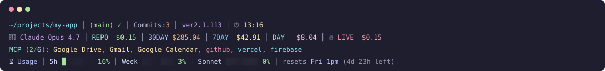

<div align="center">

# Claude Code Statusline

### A 4-line Catppuccin Mocha statusline for **Claude Code** — shows your directory, git state, model, spend, MCP server health, and **real-time rate-limit usage** pulled live from Anthropic's OAuth usage endpoint.

<p>
  <a href="https://github.com/wpark1025/statusline/stargazers"></a>
  <a href="https://github.com/wpark1025/statusline/blob/main/LICENSE"></a>
  
  
</p>



</div>

---

## Why this exists

Claude Code's built-in status bar is minimal — a model name and not much else. If you work in **Claude Code** all day, you probably want to know at a glance:

- How close you are to your **5-hour** and **weekly** rate limits (the numbers from `/usage`) — without running `/usage` every time
- Which **MCP servers** are actually connected vs. silently broken
- How much you've spent today, this week, this month
- Your git branch and whether you have uncommitted changes
- The Claude Code CLI version you're running

This statusline surfaces all of that in 4 lines, continuously, with no slash commands.

> **Built for power users of the [Claude Code CLI](https://claude.com/code)** — the official Anthropic terminal agent from the makers of Claude Sonnet, Claude Opus, and Claude Haiku.

---

## Features

- **📁 Directory + Git** — current path, branch, clean/dirty indicator, commits today
- **🧠 Model + Spend** — active Claude model with cost for this session, today, the week, and the month
- **🔌 MCP Server Health** — live `claude mcp list` status, color-coded (connected / needs auth / failed)
- **⏳ Real Anthropic Rate Limits** — 5-hour window, 7-day window, Sonnet-only window, with reset time and countdown, pulled from the **same API endpoint** `/usage` uses
- **🎨 Catppuccin Mocha** — warm, readable, beloved palette
- **⚡ Fast** — background workers + 60s caches keep renders under 200ms even with network calls
- **🛡️ No secrets stored** — uses your existing OAuth token from `~/.claude/.credentials.json`; nothing leaves your machine except the authenticated call to `api.anthropic.com`

---

## What each line shows

### Line 1 — environment

```
~/projects/my-app │ (main) ✓ │ Commits:3 │ ver2.1.113 │ 🕐 13:16
```

Current working directory (shortened if deep), git branch with ✓ clean or ✗ dirty, commits pushed today, installed **Claude Code CLI version**, and local wall-clock.

### Line 2 — model and cost

```
🧠 Claude Opus 4.7 │ REPO $0.15 │ 30DAY $285.04 │ 7DAY $42.91 │ DAY $8.04 │ 🔥 LIVE $0.15
```

Active model (🧠 Opus, 🎵 Sonnet, ⚡ Haiku), current-session cost (`REPO`), and 30-day / 7-day / today spending **estimates** aggregated from `~/.claude/projects/**/*.jsonl` against published API list prices. The live session cost mirrors Claude Code's own counter.

### Line 3 — MCP server health

```
MCP (2/6): Google Drive, Gmail, Google Calendar, github, vercel, firebase
```

Live output of `claude mcp list` cached for 60s. Names are colored: **sky blue** = connected, **yellow** = needs authentication, **red** = failed. Great for catching a silently-disconnected MCP before it costs you a debug loop.

### Line 4 — real usage limits

```
⏳ Usage │ 5h █░░░░░░░ 16% │ Week ░░░░░░░░ 3% │ Sonnet ░░░░░░░░ 0% │ resets Fri 1pm (4d 23h left)
```

This is the **exact data** shown by the `/usage` slash command inside Claude Code, surfaced continuously. Fetched from:

```http
GET https://api.anthropic.com/api/oauth/usage
Authorization: Bearer <your OAuth token>
anthropic-beta: oauth-2025-04-20
```

The response includes `five_hour`, `seven_day`, `seven_day_sonnet`, and optionally `seven_day_opus` utilization percentages — all with real reset timestamps from Anthropic. No guesswork, no estimated caps.

The progress bar and percentage shift color as you approach your limit:
**🟢 green** under 40% → **🟡 yellow** under 70% → **🟠 peach** under 90% → **🔴 red** at 90%+.

---

## Install

**Requirements**: Node.js (v18+), the `claude` CLI on your `PATH`, and Bash (Git Bash on Windows, default bash on macOS / Linux).

### 1. Clone into your Claude config directory

```bash
git clone https://github.com/wpark1025/statusline.git ~/.claude/statusline
```

### 2. Register the statusline

Add this block to `~/.claude/settings.json`:

```json
{
  "statusLine": {
    "type": "command",
    "command": "bash ~/.claude/statusline/statusline.sh"
  }
}
```

On **Windows with Git Bash**, if `~` doesn't expand correctly inside Claude Code, use the absolute path:

```json
"statusLine": {
  "type": "command",
  "command": "bash \"C:/Users/YOUR_NAME/.claude/statusline/statusline.sh\""
}
```

### 3. Start a new Claude Code session

That's it. The four lines appear above your prompt.

---

## How the usage endpoint works

The statusline reads your existing OAuth token from `~/.claude/.credentials.json` — the same file Claude Code writes on first login — and issues a **single authenticated GET** request to Anthropic's usage endpoint. The response is cached locally and refreshed in the background every 60 seconds so renders never block on the network.

Your credentials are **never** written to disk anywhere new, **never** transmitted to any third party, and the network call is the same one your browser makes when you check the `/usage` view. The source is a few dozen lines of readable Node.js in [`statusline-refresh-usage.js`](./statusline-refresh-usage.js) — audit it yourself.

---

## File structure

| File | Role |
|---|---|
| [`statusline.sh`](./statusline.sh) | Bash entry point invoked by Claude Code |
| [`statusline.js`](./statusline.js) | Main renderer — produces all 4 lines |
| [`statusline-refresh-mcp.js`](./statusline-refresh-mcp.js) | Background worker — caches `claude mcp list` output |
| [`statusline-refresh-usage.js`](./statusline-refresh-usage.js) | Background worker — caches Anthropic usage response |
| [`preview.svg`](./preview.svg) | The visual at the top of this README |

Both background workers are detached and unref'd — the main statusline returns immediately and the workers update their caches out-of-band.

---

## FAQ

**Does this work on macOS and Linux?**
Yes. The code is portable Node.js. The only Windows-specific logic is spawning the background workers with `shell: true`, which is benign on Unix.

**Will it slow down my prompt?**
Warm renders complete in 100–250ms on a typical laptop. The first render after a long idle period triggers background cache refreshes for MCP and usage (each ~2–6s network), but the render itself still returns immediately — you'll see `refreshing…` briefly, then real data on the next tick.

**Can I change the colors?**
Yes. The Catppuccin Mocha palette lives at the top of [`statusline.js`](./statusline.js). Swap RGB values for Nord, Gruvbox, Tokyo Night, Rosé Pine, Dracula, or your own palette — the structure stays the same.

**How accurate are the 30DAY / 7DAY / DAY cost numbers?**
They're **estimates**. Claude Code logs token usage per-turn in the session transcripts but not the final billed cost. The statusline multiplies those token counts by published API list prices. If you're on a subscription plan (Pro, Max), your actual billed cost is likely **lower** than shown. The usage-percentage line (line 4) is what actually reflects your rate-limit status.

**What if I have multiple Claude Code accounts?**
The statusline reads whichever account is currently logged in via `~/.claude/.credentials.json`.

**Does it break if I'm offline?**
No. Usage data falls back to a stale cache with a soft `refreshing…` label. Everything else (directory, git, model, MCP) renders from local state.

**Can I add more lines / different metrics?**
Yes — `statusline.js` is ~500 lines of readable Node with one function per line (`line1`, `line2`, …). Fork and add a `line5` if you want uptime, system load, prayer times, pomodoro timers, whatever.

---

## Keywords

`claude code` · `claude code statusline` · `claude code cli` · `anthropic claude` · `claude code status bar` · `claude code plugin` · `claude code customization` · `claude rate limit monitor` · `anthropic usage tracker` · `5 hour usage limit` · `weekly usage limit` · `claude pro` · `claude max` · `claude sonnet` · `claude opus` · `claude haiku` · `mcp server status` · `model context protocol` · `catppuccin mocha terminal` · `developer terminal productivity` · `terminal customization` · `windows claude code` · `git bash statusline` · `claude ide integration`

---

## Contributing

PRs welcome. Open an issue for theme requests, additional metrics, or bug reports. If you build a palette variant (Nord, Tokyo Night, Dracula, etc.), send it in — I'll add it to a `themes/` folder.

## License

[MIT](./LICENSE) © 2026 Won Joon Park

---

<div align="center">
<sub>Built with Claude Code itself. If this statusline saved you a slash-command roundtrip, a ⭐ is appreciated.</sub>
</div>
